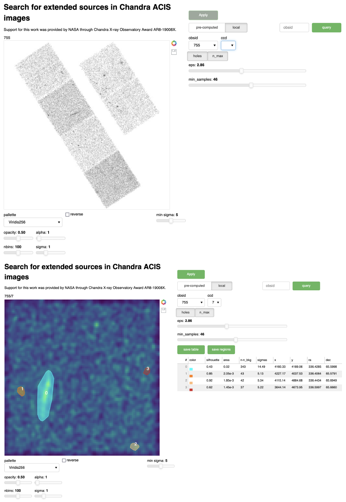

[](https://hub.gke2.mybinder.org/user/ivv101-chases-ftgal3pq/proxy/5006/app)



# About

This project provides Python code allowing to search for extended 
sources in Chandra X-ray Observatory ACIS images using 
DBSCAN cluster detection algorithm. The python code uses Bokeh 
library to produce a convenient and interactive 
graphical user interface (GUI) which will run on 
Bokeh server in user's default browser (Chrome is recommended). 
The clustering search is done on-the-fly by selecting 
the desired algorithm and visualization parameters in the GUI. 
The outcome of the search is shown graphically as well as in the 
tabular form. It includes the coordinates of found 
extended sources and their detection significances. 
The corresponding regions can be exported in SAO DS9 format.

# Installation

1. Clone this repo and

```
cd Chandra-ACIS-clusters-app
```

2. [optional] Create environment

```
mamba create -n Chandra-ACIS-clusters-app-env
mamba activate Chandra-ACIS-clusters-app-env
```

2. Install dependencies

```
mamba env update --file environment.yml
```

3. Run Bokeh server

```
bokeh serve app/app1.py --show
```

Selected 1042 Chandra ACIS ObsIDs with point sources removed are available at 🤗 Hugging Face:

* [Chandra-ACIS-clusters-data](https://huggingface.co/datasets/oyk100/Chandra-ACIS-clusters-data)


